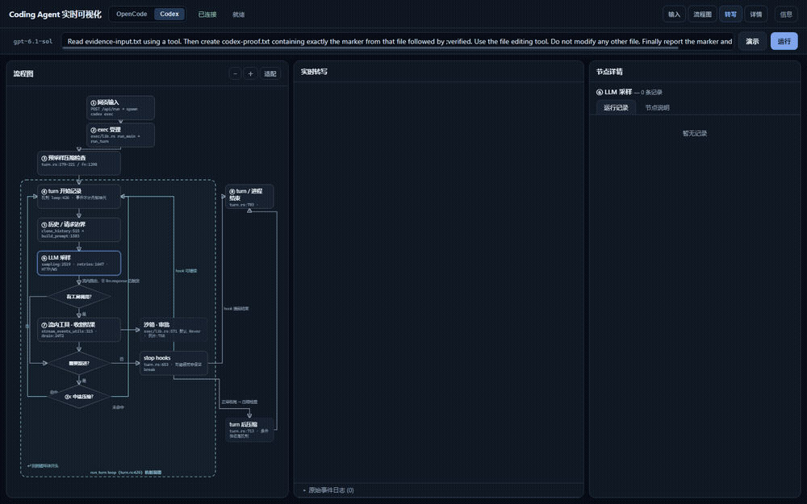

# harness-viz

**在浏览器里看清 Codex 和 OpenCode 如何完成一个编程任务。**

运行真实 CLI，查看工具调用、执行结果和客户端模型上下文；点击流程图节点，对照源码理解每一步。

[](docs/assets/demo.webm)

点击查看视频：输入任务、运行、查看工具结果和上下文。演示使用真实任务记录的加速回放，不模拟模型输出。

## 快速开始

需要 **Node.js 22+**。克隆仓库后，在项目目录运行：

```sh
npm install -g @openai/codex@0.160.0 opencode-ai@1.18.34
codex login
npm start
```

打开 **http://127.0.0.1:4577** → 点击「演示任务」→「运行」。无需安装本项目的 npm 依赖。

默认使用 Codex 官方模型 `gpt-6.1-sol`。演示项目自动复制到 `.runtime/workspace/`，默认任务在副本中执行，仓库示例不作为工作目录。

要观察自己的项目：

```sh
npm start -- --project "/path/to/your-project"
```

任务会真实执行命令和修改文件，也会消耗模型额度。请先使用演示项目或独立分支。

## 能看到什么

- **流程图**：源码机制及对应的事件记录。
- **实时转写**：助手输出、工具调用、结果和权限询问。
- **上下文详情**：直接查看客户端请求、工具定义和响应，并区分证据来源。

## 模型设置

只需编辑 **[`config/settings.json`](config/settings.json)**，然后重启。

| 模式 | 默认模型 | 认证 |
|---|---|---|
| Codex | `gpt-6.1-sol` | Codex 登录或官方 API key |
| OpenCode | `MiniMax-M3.1-Flash-Preview` | `MINIMAX_API_KEY`，需支持该 Preview 模型的 M Plan 凭据 |

使用 OpenCode 前设置密钥环境变量：PowerShell 用 `$env:MINIMAX_API_KEY="你的密钥"`，macOS/Linux 用 `export MINIMAX_API_KEY="你的密钥"`。

Codex 也支持第三方模型：将 `codex.useDefaultModel` 设为 `false`，`codex.model` 改为 `MiniMax-M3.1-Flash-Preview`。该模式使用有损协议转换，不能视为官方模型的等价链路。

## 项目结构

| 目录 | 用途 |
|---|---|
| `config/` | 唯一的用户设置 |
| `src/`、`public/` | 后端、版本信息与网页 |
| `examples/demo/` | 可复制的最小演示项目 |
| `tests/`、`scripts/` | 回归测试与开发验证工具 |
| `docs/assets/` | 使用演示 GIF 与视频 |
| `.runtime/` | 自动生成的工作副本、日志、认证和验证记录，**不提交 Git** |

## 边界与开发

流程图是源码机制简图，不是逐函数追踪；客户端捕获不等于服务端最终提示词或完整内部推理，流程结束也不代表代码正确。捕获可能含敏感内容，请勿公开 `.runtime/`。

`npm test` 运行无模型回归测试；`npm run test:integration` 使用临时项目调用真实模型；`npm run test:browser -- ".runtime/verification/<run>"` 检查记录回放。CLI 版本和源码固定在 [`src/versions.json`](src/versions.json)，详细定位在界面节点说明中。

[MIT License](LICENSE)
